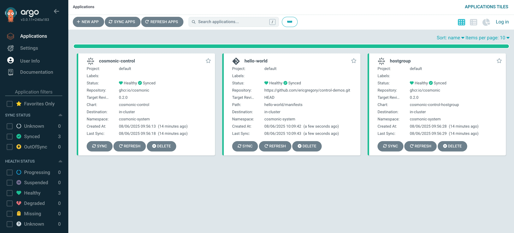
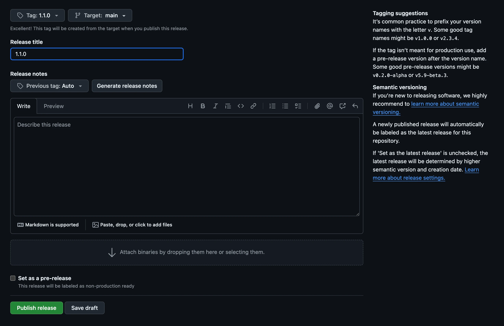
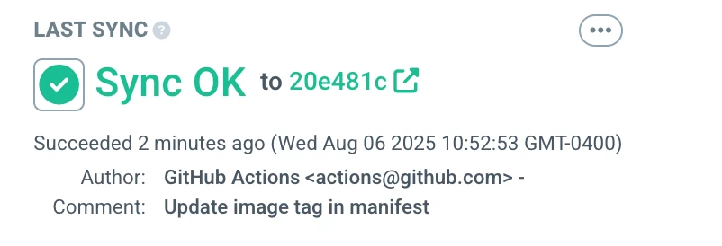

# GitOps with Cosmonic Control and Argo CD

This repository includes an Argo CD Application CRD manifest that can be used to deploy [Cosmonic Control](https://cosmonic.com/docs/install-cosmonic-control), a [HostGroup](https://cosmonic.com/docs/custom-resources/#hostgroup), and a [Hello World WebAssembly (Wasm) component](https://github.com/cosmonic-labs/control-demos/tree/main/hello-world) with Argo CD.

## Requirements

* A Kubernetes cluster with CoreDNS. (This guide was written using [`kind`](https://kind.sigs.k8s.io/) version 0.27.0, which includes CoreDNS by default.)
* [`kubectl`](https://kubernetes.io/releases/download/)
* [Helm](https://helm.sh/docs) v3.8.0+
* A [GitHub account](https://github.com/signup)

## Fork the repository

Navigate to the [`control-demos` repository in GitHub](https://github.com/cosmonic-labs/control-demos) and create a fork of the repo. (These instructions assume that you use the name `control-demos` for your fork&mdash;everything will still work if you change the name, but remember to adjust the commands accordingly.)


It's up to you whether you'd prefer to clone the repo locally or work entirely in the browser. The only significant difference is that you'll need to copy and paste a few Argo CD Application CRD manifests if you work in the browser. 

If you decide to clone the repo, navigate to the `argo-cd` subdirectory:

```shell
git clone https://github.com/<your-github-namespace>/control-demos.git
```
```shell
cd control-demos/integrations/argo-cd
```

## Deploy Argo CD and Cosmonic Control

Install Argo CD using the [community-maintained Helm chart](https://argoproj.github.io/argo-helm/). This Argo CD installation will run without authentication so we can jump straight into the example:

```shell
helm install argocd oci://ghcr.io/argoproj/argo-helm/argo-cd --set-string configs.params."server\.disable\.auth"=true --version 8.1.3 --create-namespace -n argocd
```

Port-forward the Argo CD server in order to access the dashboard. (Note: We're using our local port 3000 for the Argo CD dashboard in order to leave 8080 for the Cosmonic Control Console UI.)

```shell
kubectl port-forward service/argocd-server -n argocd 3000:443
```

You should see the Argo CD dashboard without any running Applications.


We will use the Argo Application CRD manifests in this directory to define deployments for: 

* Cosmonic Control
* A Cosmonic Control HostGroup
* A Hello World Wasm component

The sources for Cosmonic Control and the HostGroup will be their Helm charts. Apply the manifests for those first:

```shell
kubectl apply -f control-proj.yaml
```
```shell
kubectl apply -f hostgroup-proj.yaml
```

The Applications will appear on the Argo CD dashboard. It will take a moment for the Applications to finish syncing.


Once the Applications are synced and healthy, you can port-forward to access the Cosmonic Control Console UI at [localhost:8080](http://localhost:8080):

```shell
kubectl -n cosmonic-system port-forward svc/console 8080:8080
```

## Trigger a Wasm component sync with a GitHub release

Now let's try a more in-depth GitOps workflow to trigger a Wasm component sync with a GitHub release. 

### Deploy the hello-world Argo Application CRD manifest

Modify `hello-proj.yaml` to update the `repoURL` on Line 9 to target your new fork of the control-demos repo:

```diff
+ repoURL: https://github.com/<your-github-namespace>/control-demos.git
- repoURL: https://github.com/cosmonic-labs/control-demos.git
```

The Argo Application is now targeting a manifest file in the `hello-world` directory of your control-demos fork. Let's take a quick look at the component's manifest:

```yaml
apiVersion: runtime.wasmcloud.dev/v1alpha1
kind: Component
metadata:
  name: hello-world
spec:
  image: ghcr.io/cosmonic-labs/components/hello-world:1.0.0
  concurrency: 100
  replicas: 1
  hostSelector:
    matchLabels:
      "hostgroup": "default"
  exports:
    - wit:
        namespace: wasi
        package: http
        interfaces:
          - incoming-handler
      target:
        provider:
          name: http-default
          namespace: cosmonic-system
        configFrom:
          - name: hello-world-config
---
apiVersion: runtime.wasmcloud.dev/v1alpha1
kind: Config
metadata:
  name: hello-world-config
spec:
  config:
    - name: host
      value: "localhost:9091"
```

Don't make any changes at this stage, but note the OCI artifact we're using on Line 6: it's in the `cosmonic-labs` namespace and tagged `1.0.0`.

Now apply the `hello-proj.yaml` Argo Application CRD manifest from `integrations/argo-cd/`:

```shell
kubectl apply -f hello-proj.yaml
```



The `hello-world` Application is configured to **Auto-Sync**&mdash;when Argo detects changes to the source manifest, it will roll out an update to the deployment. 

You can click on an Application to view it in more detail. Try clicking on the hello-world Application to view the resources defining the Wasm workload.


### Optional: Modify the Wasm component

While not strictly necessary for the purposes of this example, at this stage you could use the GitHub web UI to edit the Rust code in `hello-world/src/lib.rs` and change the "Hello world" message, like so:

```diff
+ Ok(http::Response::new("Hello from Cosmonic Control and Argo CD!\n"))
- Ok(http::Response::new("Hello from Cosmonic Control!\n"))
```

If you decide to edit the message, commit the changes. 

### Create a release

Now we'll create a release in GitHub. Click "Create a new release" in the right sidebar of your control-demo fork's repository page, or navigate to `https://github.com/<your-github-namespace>/control-demos/releases/new`.


Let's call our release `1.1.0`. Create a new image tag, title the release, and click "Publish release."



Publishing the release will trigger a GitHub Workflow. (If you'd like to watch the run, you can click the "Actions" tab for the repo and select "publish" under Jobs.) This workflow will:

* Compile a Wasm binary from the Rust code in the hello-world directory using the [setup-wash GitHub Action](https://github.com/cosmonic-labs/setup-wash-action)
* Push the Wasm component to ghcr.io as an OCI artifact under your namespace
* Update the image tag in the component's Kubernetes manifest to reflect the version of your new release
* Commit and push the manifest update in your repo

**Note**: The first time this workflow runs in your repository, it will take several minutes to build the necessary tooling, but those tools will be cached&mdash;future runs in the repo will generally take under a minute.

In the meantime, let's take a look at the last steps of the GitHub Workflow file:

```yaml
     - name: Update image tag in Kubernetes manifest
       working-directory: ./hello-world
       run: |
          DEPLOYMENT_FILE="manifests/component.yaml"
          OLD_IMAGE=$(grep "image:" "$DEPLOYMENT_FILE" | awk '{print $2}')
          NEW_IMAGE="ghcr.io/${{ env.GHCR_REPO_NAMESPACE }}/components/hello-world:${{ github.ref_name }}"
          # Update the image tag
          sed -i "s|image:.*|image: $NEW_IMAGE|" "$DEPLOYMENT_FILE"

     - name: Commit and push manifest update
       working-directory: ./
       run: |
          git config --local user.email "actions@github.com"
          git config --local user.name "GitHub Actions"
          git add hello-world/manifests/component.yaml
          git commit -m "Update image tag in manifest"
          git push
```

After building the component from your repo, the run updates the image specification in the hello-world manifest that our Argo CD hello-world Application is targeting, so that the manifest specifies a 1.1.0 image in *your* GHCR registry. This change to the manifest will trigger a sync in Argo CD.

Once the run completes successfully, switch over to the Argo CD UI and take a look at the hello-world Application. You should see that it has synced. 



You can click through to see the commit that triggered the sync, or click on the Application at the left-hand side of the diagram and see the events associated with it:


## Test the deployment

Port-forward to access the hello-world component at [localhost:9091](http://localhost:9091):

```shell
kubectl -n cosmonic-system port-forward svc/hostgroup-default 9091:9091
```

In a new terminal tab:

```shell
curl localhost:9091
```
```text
Hello from Cosmonic Control and Argo CD!
```

## Clean up

When you're finished:

```shell
kubectl delete -f control-proj.yaml
```
```shell
kubectl delete -f hostgroup-proj.yaml
```
```shell
kubectl delete -f hello-proj.yaml
```

```shell
helm uninstall argocd -n argocd
```

If you're using `kind`:

```shell
kind delete cluster
```
